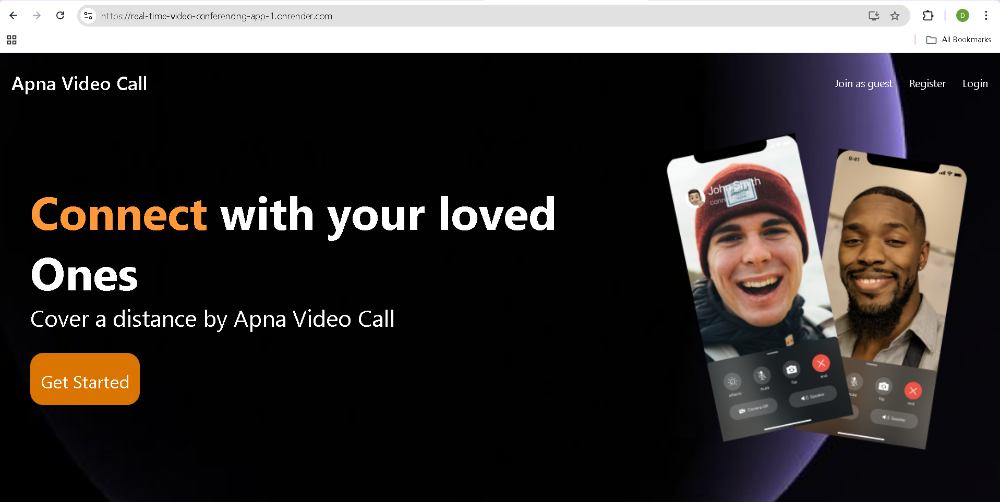
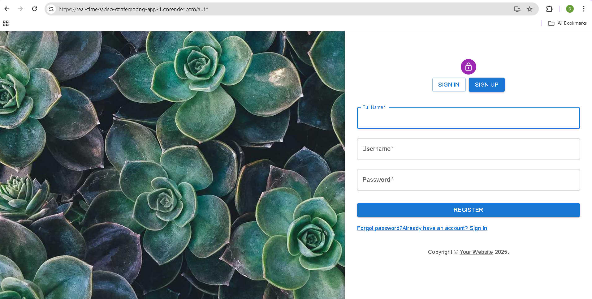
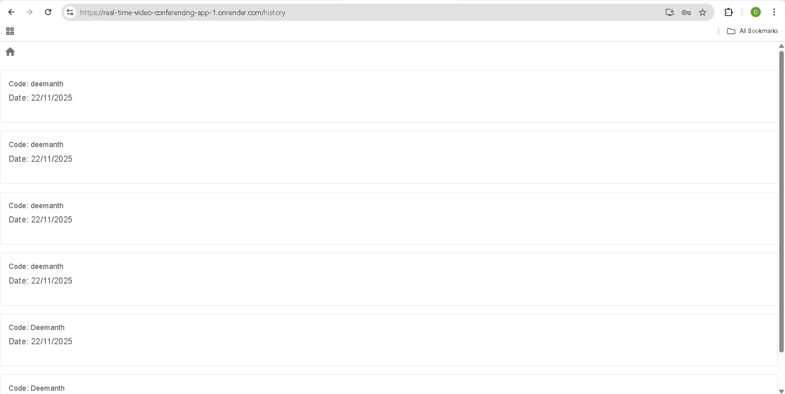

# Apna Video Call - Complete Video Conferencing App
A full-stack real-time video conferencing application with WebRTC, Socket.io, and React.

## 🚀 Features

**Frontend:**
- 🎥 Real-time video calls with WebRTC

- 💬 Live chat during meetings

- 📱 Responsive design with Material-UI

- 🔐 User authentication & authorization

- 📊 Meeting history tracking

- 🖥️ Screen sharing capability

- 🎤 Audio/Video controls

- 👥 Multi-user conference rooms

**Backend:**
- 🔐 JWT-based authentication

- 💾 MongoDB for data persistence

- 🔄 Socket.io for real-time communication

- 📡 WebRTC signaling server

- 🛡️ CORS enabled & secure headers

- 📝 RESTful API endpoints

## 🛠️ Tech Stack
**Frontend**
- React - UI framework

- Material-UI - Component library

- Socket.io-client - Real-time communication

- React Router - Navigation

- Axios - HTTP client

**Backend**
- Node.js - Runtime environment

- Express.js - Web framework

- Socket.io - WebSocket library

- MongoDB - Database

- Mongoose - ODM

- bcrypt - Password hashing

- JWT - Authentication

## 📸 Screenshots
- 🏠 Landing Page

- 🔐 Authentication Page

- 🏠 Home Dashboard

- 🎪 Video Call Lobby

- 📹 Video Call Interface

- 💬 Chat During Call

- 🖥️ Screen Sharing

- 📊 Meeting History

## 📦 Installation & Setup
**Prerequisites**
- Node.js (v14 or higher)
- MongoDB
- Modern web browser with WebRTC support

**Backend Setup**
1. **Navigate to backend directory:**
    bash
    cd backend

2. **Install dependencies:**
    bash
    npm install

3. **Create .env file:**
    env
    PORT=8000
    MONGO_URI=mongodb://localhost:27017/video-conference

4. **Start the backend server:**
    bash
    npm run dev

## Frontend Setup

1. **Navigate to frontend directory:**
    bash
    cd frontend

2. **Install dependencies:**
    bash
    npm install

3. **Create environment configuration:**
    javascript
    // src/environment.js
    const server = "http://localhost:8000";
    export default server;

4. **Start the frontend development server:**
    bash
    npm start

## 🗂️ Project Structure
text
video-conference-app/
├── backend/
│   ├── controllers/
│   │   ├── manageSocketio.js
│   │   └── users.controller.js
│   ├── models/
│   │   ├── user.model.js
│   │   └── meeting.model.js
│   ├── routes/
│   │   └── users.routes.js
│   ├── server.js
│   └── package.json
└── frontend/
    ├── src/
    │   ├── contexts/
    │   │   └── AuthContext.jsx
    │   ├── pages/
    │   │   ├── authentication.jsx
    │   │   ├── home.jsx
    │   │   ├── history.jsx
    │   │   ├── landing.jsx
    │   │   └── VideoMeet.jsx
    │   ├── utils/
    │   │   └── withAuth.js
    │   ├── App.js
    │   └── index.js
    └── package.json

# 🔌 API Endpoints

**Authentication**
- POST /api/v1/users/register - User registration

- POST /api/v1/users/login - User login

**Meeting History**
- POST /api/v1/users/addToActivity - Add meeting to history

- GET /api/v1/users/allActivity - Get user meeting history

**Socket Events**
- join-call - Join video call room

- signal - WebRTC signaling

- chat-message - Send/receive chat messages

- user-joined - New user joined

- user-left - User left call

## 🎯 Usage
1. Landing Page: Visit / to see the landing page
2. Authentication: Register or login at /auth
3. Home: After login, access dashboard at /home
4. Join Meeting: Enter meeting code to join video call
5. Video Call: Access video interface at /:meetingCode
6. History: View meeting history at /history

## 🔧 Key Features Implementation

**WebRTC Implementation**
- Peer-to-peer connections using RTCPeerConnection
- STUN servers for NAT traversal
- Real-time media streaming

**Real-time Communication**
- Socket.io for signaling
- Room-based communication
- Chat functionality

**Authentication Flow**
- JWT tokens for session management
- Protected routes with HOC
- Secure password hashing

🌐 Deployment

**Backend Deployment**
- Deploy to Heroku, Railway, or DigitalOcean
- Set environment variables
- Configure MongoDB Atlas

**Frontend Deployment**
- Build with npm run build
- Deploy to Netlify, Vercel, or GitHub Pages
- Update server URL in environment config

## 🔒 Security Features
- Password hashing with bcrypt
- JWT token authentication
- CORS configuration
- Input validation
- Secure WebRTC connections

## 🐛 Troubleshooting

**Common Issues**
1. Camera/Microphone access: Ensure HTTPS in production
2. Connection issues: Check firewall and NAT settings
3. Socket connection: Verify server URL configuration

**Browser Support**
- Chrome (recommended)
- Firefox
- Safari
- Edge

## 📝 License
MIT License - feel free to use this project for learning and development.

## 🤝 Contributing
Contributions, issues, and feature requests are welcome!

## 👨‍💻 Author
- **[Deemanth Yadav](https://github.com/Deemanthyadav74833)** - GitHub Profile

## 🙏 Acknowledgments

- Socket.io team for real-time communication

- WebRTC team for peer-to-peer video streaming

- Material-UI for the component library

- MongoDB for database solutions

## Happy Coding! 🎉